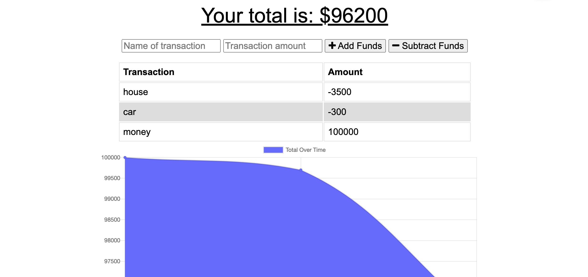

# Budget Tracker
  

## Description

Budget Tracker is budgeting application that allows for offline access and functionality. The user is able to add expenses and deposits to their budget with or without an internet connection. If the user enters transactions offline, the total will be updated when they're brought back online.

## Built With
* HTML
* CSS
* JS
* Express
* Mongoose
* IndexedDB

## Website

 https://lindsey-budget-tracker.herokuapp.com/ 

## Contribution
Made with ❤️ by Lindsey 
# budget-tracker-homework